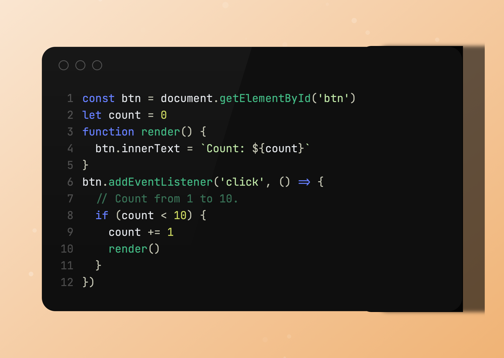

# WebTool - Pixel 

[Références 1](https://www.piskelapp.com/p/create/sprite/) - [Références 2](https://www.aseprite.org) - [Références 3](https://f-nt.eu/fr) - [Références 4](https://lmdbt.forge.apps.education.fr/pixel-it/)

## 1. L'idée 
- consiste à créer une composition graphique avec des formes
- Un clic = forme de base > carré
- Un clic sur une case coloré = changement de forme 
- Sélectionner une couleur de pixel et background
- (+ Background image)
- Choisir une couleur pour la forme (+contour)
- Choisir une taille 
- Choisir le format de la composition
- Exporter 


## 2. Description de l'outil
L’utilisateur pourra choisir sa couleur de fond ou bien importer une image. 
Il pourra également choisir la couleur et la taille de la forme. Et également changer la forme en cliquant plusieurs fois sur celle-ci.
Les formes primitives de base puis des formes tel qu’un carré avec des coins arrondis par exemple.
À la fin de sa création, l’utilisateur pourra exporter sa composition.

## 3. Pour aller plus loin

Si possible à ajouter :
- Importer une image
- Pouvoir mettre un contour en couleur à ma forme 
- Choisir la taille de la grille > pixel
- Créer un dégrader de couleur pour le background

## 4. Les snippets
Découpage des bouts de code pour le projet :

- Placer une forme suivant la grille au clic
- Changer la forme lorsqu'on clic dessus
- Changer la couleur de fond de la forme
- Chosir une couleur de fond 

**Quelques snippets à tester :**

- Titre descriptif du snippet 

```
Coller le snippet
```

- Deuxième snippet
  
